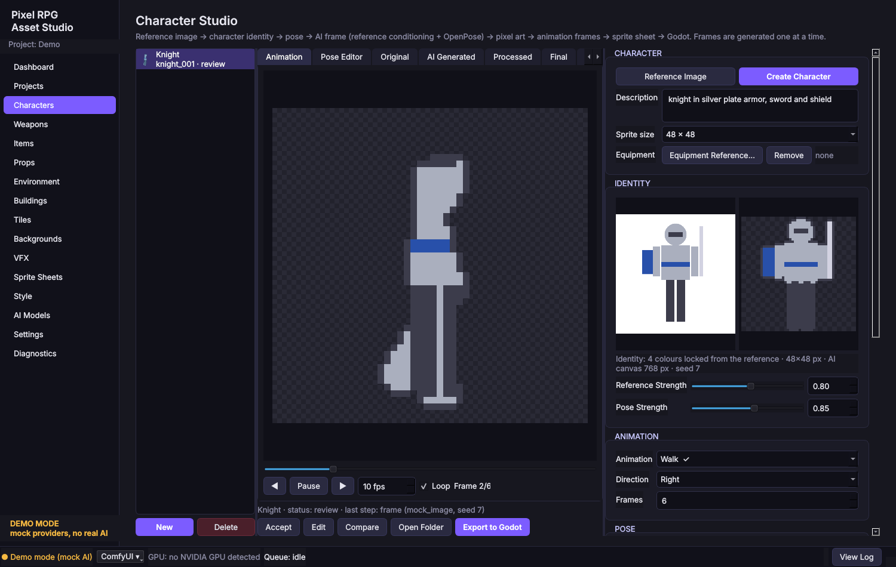

# Pixel RPG Asset Studio

A Windows-first desktop application for producing a **complete, consistent set of pixel-art assets for Godot games** with **local AI only**.

- **No paid services, no API keys, no Claude at runtime.** Image and 3D generation run on your own GPU through [ComfyUI](https://github.com/comfyanonymous/ComfyUI); 3D processing, rigging and rendering run in [Blender](https://www.blender.org/). Both are free.
- **Deterministic pixel processing.** AI produces concepts and 3D shapes. The final pixel grid always comes from reproducible, recorded processing: palette quantisation, mode-downscaling, outlines and alignment.
- **Consistency by construction.** Characters are rendered from one 3D model with one stored camera framing and a locked palette. Every asset follows the project's global style.
- **Everything is reproducible.** Seed, model, workflow, prompts, parameters, reference file hashes and timestamps are stored for every step. Single frames can be regenerated without touching the rest of the animation.
- **Godot-ready.** It exports sprite sheets, individual PNGs, JSON metadata, `SpriteFrames` and `TileSet` resources (with terrain sets for autotiling), plus a helper script. Existing files are never overwritten without confirmation.



## Asset types

| Studio | Pipeline |
|---|---|
| Characters | concept → master reference → 3D model → Blender cleanup + colour projection → automatic humanoid rig → procedural animations (idle, walk, run, attack, heavy attack, hit, death, block, skill, cast, dodge) → 1/2/4/8 directions → pixel art → sprite sheets |
| Weapons, Items, Props, Environment | concept / reference → optional 3D → fixed-camera views → pixel art |
| Buildings | like props, plus footprint, per-asset perspective/camera angle (incl. top-down), consistent multi-view renders |
| Tiles / Tilesets | seamless terrain tiles → 16 corner transitions + variants → Godot `TileSet` with terrain set; seamless test grid and connection preview |
| Backgrounds | 2D pipeline, optional parallax layers (sky/far/mid/near), manual import |
| VFX | deterministic seeded particle effects (fire, smoke, explosion, magic, lightning, soul, heal, hit, impact) or imported frames |
| Sprite Sheets | arrange/slice frames, columns/padding/spacing, FPS/loop preview, PNG + metadata |

New asset types are added through the registry in `project/asset_types.py` and reuse the shared pipelines.

## Quick start (users)

1. Download from the GitHub **Actions** artifacts or the **Releases** page: either the **folder version** (`…-onedir.zip`, recommended: extract anywhere, starts fast, needs no space on C:) or the single `PixelRPGAssetStudio.exe` (unpacks itself to the temp folder on C: at every start).
2. Double-click it. The setup wizard detects your GPU, ComfyUI and Blender, and explains anything that is missing.
3. Install whatever is missing. Every item has a download link:
   - **ComfyUI** (Portable or Desktop) – runs the AI models
   - **Blender 3.6 LTS or newer** – 3D processing and rendering
   - **AI models** – listed with official download pages and licenses on the *AI Models* page. They are never downloaded automatically.
4. Create a project, set up its style, and start in the **Character Studio**.

Want to see the interface first? Start with `--mock`, or tick *demo mode* in the wizard. Mock providers produce clearly labelled placeholder results without any AI.

Full guide: [docs/user_guide.md](docs/user_guide.md) · Problems: [docs/troubleshooting.md](docs/troubleshooting.md) · Models and licenses: [docs/models_and_licenses.md](docs/models_and_licenses.md)

## Hardware

The primary target is an **NVIDIA RTX 3060 (12 GB)**. VRAM is detected automatically. On 8 GB or less (or unknown hardware) the app picks the *low* profile, which means smaller generation resolution, ComfyUI `--lowvram` CPU offloading, models unloaded between stages, and strictly sequential stages.

## Development

```powershell
git clone https://github.com/SazexLucifer1/Pixel-RPG-Asset-Studio.git
cd Pixel-RPG-Asset-Studio
py -3.12 -m venv .venv
.venv\Scripts\pip install -r requirements-dev.txt
$env:PYTHONPATH="src"; .venv\Scripts\python -m pixel_rpg_studio --mock
.venv\Scripts\python -m pytest -q          # run the tests
scripts\build_windows.ps1                   # build dist\PixelRPGAssetStudio.exe
```

See [docs/development.md](docs/development.md) and [docs/architecture.md](docs/architecture.md). Design decisions are recorded in [docs/decisions.md](docs/decisions.md).

### Command line

```
PixelRPGAssetStudio.exe [--mock] [--project DIR] [--no-autostart] [--skip-wizard]
PixelRPGAssetStudio.exe --diagnose [--out report.md|report.json]
PixelRPGAssetStudio.exe --self-test      # headless end-to-end pipeline check (mock providers)
PixelRPGAssetStudio.exe --version
```

## Repository layout

```
src/pixel_rpg_studio/   application source (core, project, providers, comfyui, blender, imaging,
                        spritesheet, export, pipeline, system, models, ui)
workflows/              ComfyUI workflows (API format) + manifests
config/                 default configuration (model catalog)
tests/                  automated tests (incl. fake ComfyUI server, real-Blender and UI tests)
scripts/                build / run / test scripts
build/                  PyInstaller spec and launcher
docs/                   documentation
assets/                 application icon
```

What is **not** in the repository: AI model weights, generated assets, user projects, settings, API keys. The `.gitignore` enforces this.

## Status and honest limitations

- **Automatic rigging** is a heuristic for upright T/A-pose humanoids. The rig report shows how well skinning worked. You can open the saved `.blend` file in Blender, fix the rig or weights, save, and re-render. Models that already contain a rig and named actions (e.g. *Walk*) are used as they are.
- **Procedural animations** are simple, clean cycles. They are good for prototyping and small sprites, but they are not hand-keyed animation.
- **Hunyuan3D-2mini** produces shape only. Colours are projected from the concept image, so back and side views reuse front colours. Read its license: it **excludes the EU, UK and South Korea**. Imported models work with the same pipeline.
- **VFX** are procedural, because current local image models cannot produce temporally coherent effect frames reliably.
- ComfyUI workflows are validated against your ComfyUI installation (Diagnostics). Node names can change between ComfyUI versions. If that happens, the app tells you which node is missing.

## License

The application source is MIT-licensed (see [LICENSE](LICENSE)). ComfyUI, Blender and all AI models are separate projects with their own licenses.
